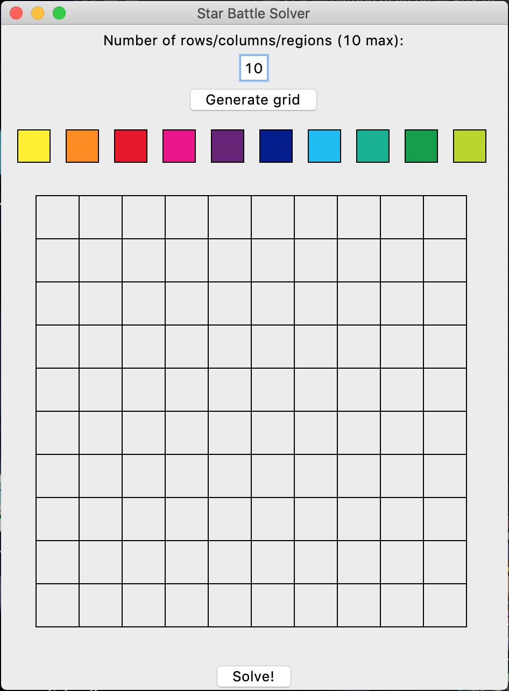
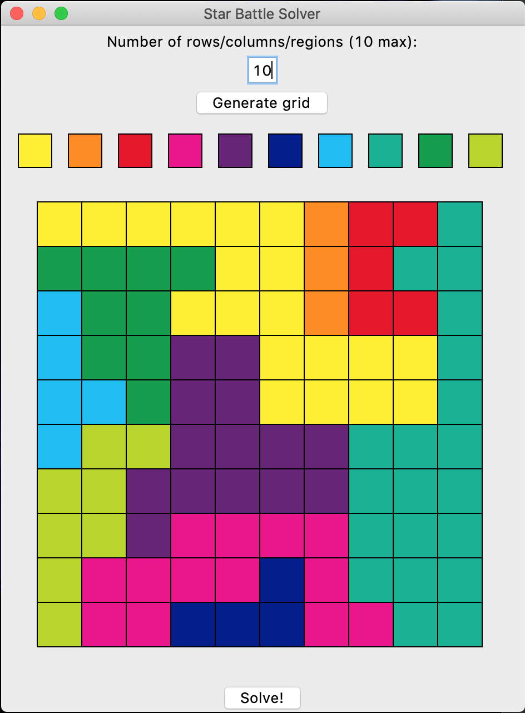
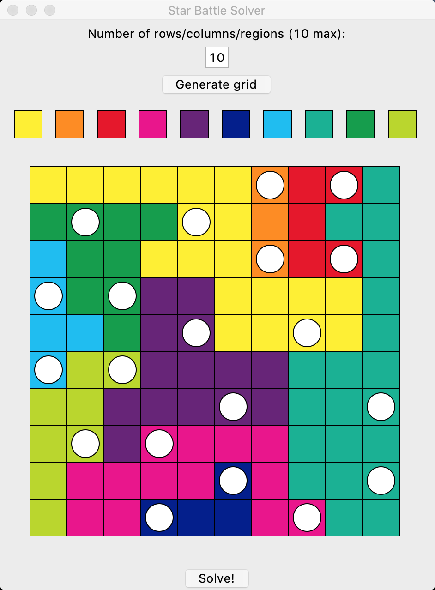
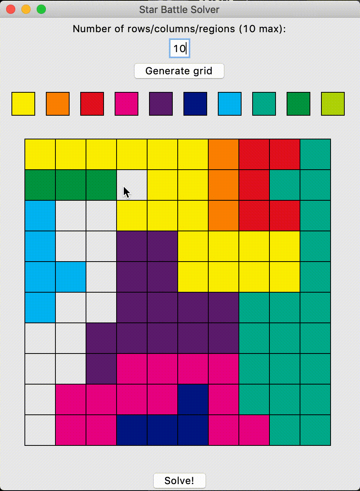

## Star Battle Solver ##

Run `python main.py` in a directory containing `main.py` and `star.py`. Make sure to color every cell before starting.

# Gallery

Fun fact: the solver works on puzzles with non-contiguous regions!

Easy things to improve on:
- Make solver able to solve with more than 2 stars per region (main.py already has some code for this)
- Comment on existence/uniqueness of solution
- Click and drag for coloring grid
- Make maximum number of regions more than 10 (really just need to make the colors list bigger)
- More error catching with bad user inputs